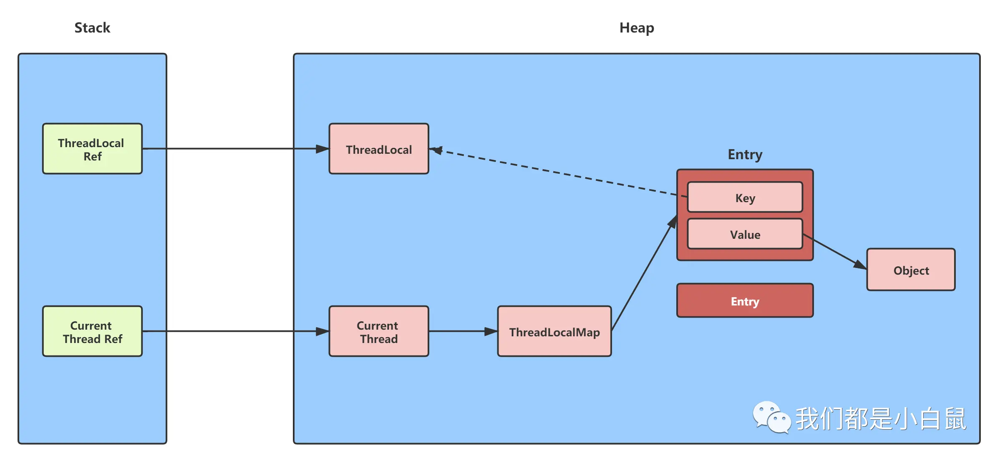

# 为什么线程池中使用可能导致内存泄漏

任务结束后，
1. ThreadLocalRef->ThreaLocal消失。
2. gc，ThreadLocal对象被回收，Entry对象指向null
3. Entry对象中的value导致内存泄漏
4. 所以要记得调用remove方法

# 谈一谈ThreadLocal
1. ThreadLocal用于储存线程本地变量，将数据缓存在线程内部，这个线程可以再任意时刻，任意方法获取缓存的数据
2. ThreadLocal里面有一个静态内部类ThreadLocalMap，每个线程都有一个ThreadLocalMap，这个map储存ThreadLocal和value组成的键值对。
3. 线程池中使用ThreadLocal会造成内存泄漏。这个内存泄漏是指上一个任务的ThreaLocal对象对应的Entry和value(储存在ThreadLocalMap中)。上一个任务结束了，所以这个任务对应的ThreaLocal也不会再用了。因为一个任务执行完毕以后线程不会被回收，会被继续使用，其中线程内部指向ThreadLocalMap的也是强引用。这个ThreadLocal是储存在这个线程的ThreadLocalMap里面的，是一个WeakReference，如果TheadLocal变量设为null，那么指向ThreaLocal对象的就只剩下一个WeakReference，会被回收。此时，TheadLocalMap里面相应的Entry对象的key变为null，但是value还存在，且指向value的是强引用，所以这个value不会被回收，相应的Entry也不会回收，就会导致内存泄漏。不过这些key为null的entry，在这个线程后续的使用中会被逐渐清除，如果后续使用中又有ThreadLocal对象，在寻找对应的插入位置的时候，当遍历到key为null的entry时会替换掉旧的
4. ThreadLocal的应用主要是连接管理，一个连接不与其他共享，但是这个线程内可以任意读取。
5. 为了防止内存泄漏，记得使用remove方法。
