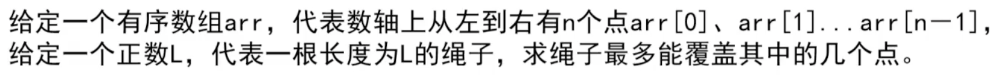
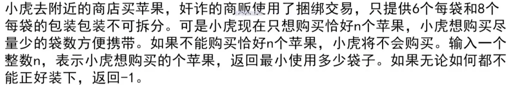
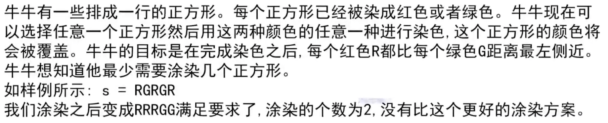
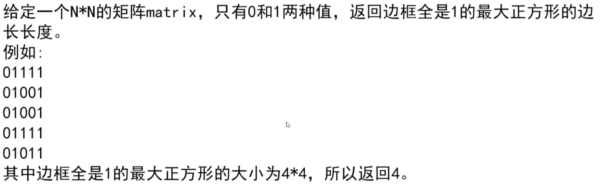
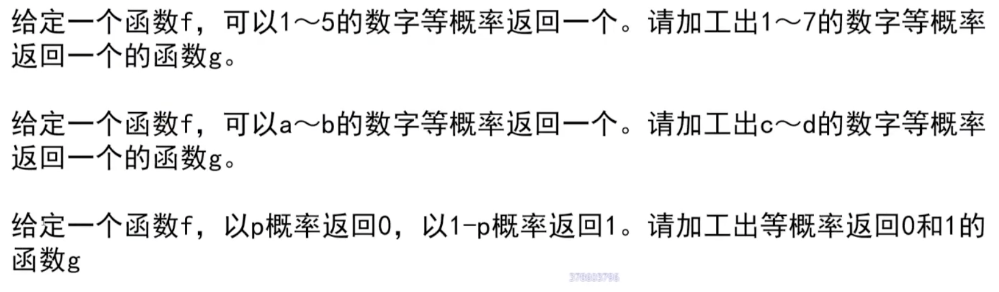

# 绳子能覆盖的点

```java
	public static void maxPoint(int[] arr, int l){
		int right = 0;
		int max = 0;
		(int i = 0, len = arr.length; i < len; i++){
			int bar = arr[i] + l;
			while(right < len && arr[right] <= bar){
				right++;
			}
			max = Math.max(max, right-i);
			if(right == len){
				break;
			}
		}
		return max;
	}
```
# 买苹果，最少使用多少袋子

```java
	public static int bag(int n){
		if(n < 6){
			return -1;
		}else if(n % 2 != 0){
			return 0;
		}
		
		for(int i = 0, len = Math.min(n / 6, 4); i <len ; i++){
			int remain = n-i*6;
			if(remain % 8 == 0){
				return remain / 8 + i;
			}
		}
		return -1;
	}
```
## 输入整数，输出整数，用打表法
输入输出都是一个整数，打印所有方法，分析得到规律
# 动物吃草，每次只能吃4的幂次方，谁赢
# 染色

```java
	public static int dye(String s){
		int[] arr = new int[s.length()];
		int red = 0;
		for(int i = 0; i < arr.length; i++){
			if(s.charAt(i) == 'R'){
				red++;
			}
			arr[i] = red;
		}
		int max = arr.length-1;
		int ans = max;
		for(int i = 0; i < arr.length; i++){
			int size = (i+1)-arr[i] + (arr[max] -arr[i]);
			ans = Math.min(size, ans);
		}
		return Math.min(Math.min(ans, arr[max]),max+1-arr[max]);
	}
```

# 边框为1的正方形的最大长度

# 数字加工
