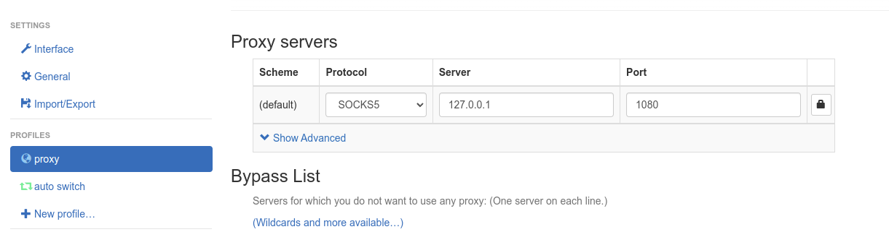
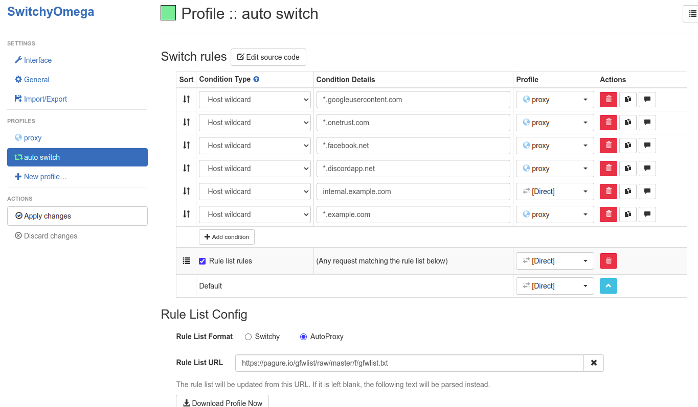

# 安装python:
```shell
sudo apt-get install python
sudo apt-get install python-pip
```
# 安装shadowsocks:
```
pip install shadowsocks
```

Troubleshooting: 如果运行中出错可以尝试换不同的版本，笔者安装的是2.8.2

安装完成后输入`sslocal --version`应显示类似如下：
```shellsession
$ sslocal --version
Shadowsocks 2.8.2
```
# 配置config文件
新建config文件`shadowsocks.json`，内容如下：
```json
# 如果是购买的vpn，那下面的情况都可以在购买的地方找到，最简单的方法是手机上shadowsocks或者购买的服务对应的软件中找到这些信息
{
        "server":"xxxx",  # 你的代理服务器
        "server_port":5456,  # 你的代理服务器端口
        "local_address":"127.0.0.1",  # 根据情况调整，通常是127.0.0.1  
        "local_port":1080, 	# 根据情况调整，通常是1080
        "password":"",   # 密码
        "timeout":300,
        "method":"chacha20"  # 根据情况调整，
}
```

# 运行代理
```
sslocal -c /path/to/shadowsocks.json  # 修改成config文件的路径
```
# 浏览器代理设置
下载SwitchOmega，添加到浏览器扩展，很简单自行百度
浏览器扩展安装好之后，先设置proxy：

图中server和port填写shadowsocks.json中local_address和local_port的值

再配置auto switch：

在下方选择`AutoProxy`，`Rule List URL`中添加链接`https://pagure.io/gfwlist/raw/master/f/gfwlist.txt` 并更新，在右上角switchyomega选择`auto proxy`就可以使用了。
有些时候部分页面可能没有在list里面加载不出来，右上角会有小三角形，可以自己选择添加代理模式，逐渐完善代理列表。
# 应用代理设置(以discord为例)：
在`/usr/share/applications`文件夹下面会有`discord.desktop`，文件本身是文本文件，进行编辑，关注`Exec`行，通常如下：


将`Exec`行修改如下：
```shell 
Exec=env http_proxy=htsocks5://127.0.0.1:1080 https_proxy=socks5://127.0.0.1:1080 /usr/share/discord/Discord --proxy-server="socks5://127.0.0.1:1080"
```
注意中间的`/usr/share/discord/Discord`是执行的文件，也就是最开始`Exec`行的值