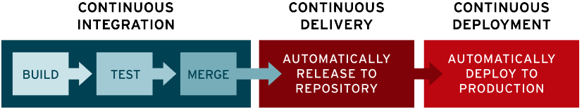

[toc]
 # 云上架构
 公有云：和其他用户共享相同的硬件、存储和网络设备，并且你可以使用 Web 浏览器访问服务和管理帐户。
 私有云：整个云都是你的，这些硬件储存网络设备属于你。服务器等可以部署在你的附近，你也可以向第三方租借。
 ## 什么是VPC
 VPC全称Virtual Private Cloud， 虚拟私有云。简单来说就是在公有云上的资源为某个用户隔离开来，所以是对用户来说是私有。因为实际上是公有云中隔离开来的模拟的私有，所以是虚拟。
## 什么是ECS/ECR
elastic container service/registry 很好理解，就提供的各种云服务，类似docker那些
elastic弹性的概念：简单来说就是根据流量分配。比如流量大增加服务器等，用户不需要考虑容量，弹性这件事由运营商提供。
# QA
## 什么是Quality Assurance
Quality Assuarance is any systematic process of determining whether a product or service meets specified requirements.

* Plan – Organization should plan and establish the process related objectives and determine the processes that are required to deliver a high-Quality end product.
* Do – Development and testing of Processes and also “do” changes in the processes
* Check – Monitoring of processes, modify the processes, and check whether it meets the predetermined objectives
* Act – A Quality Assurance tester should implement actions that are necessary to achieve improvements in the processes
## CI/CD

> CI/CD is a method to frequently deliver apps to customers by introducing automation into the stages of app development. The main concepts attributed to CI/CD are **continuous integration**, **continuous delivery**, and **continuous deployment**.

**what is CI/CD** https://www.redhat.com/en/topics/devops/what-is-ci-cd

CI/CD是集成与交付中的概念，引入自动化的方法来帮助应用频繁交付。核心概念是：持续集成、持续交付、持续部署。

CI指代continuous integration（持续集成）。集成就是将新代码合并。持续集成就是指用自动化的方法定期构建测试合并。 
CD代指continuous delivery（持续交付）和continuous deployment（持续部署）

持续集成，修改代码后定期自动build、test、merge代码。
持续交付，修改代码后自动发布然后上传到repo。
持续部署，自动将repo部署到产品，用户可用。

## 什么是staging/UAT
staging enviroment是跟产品环境几乎一模一样的副本，为了测试软件。
test enviroment：有点类似于单元测试。
两者的区别主要在于测试的规模和具体内容。staging更类似于真实世界。

